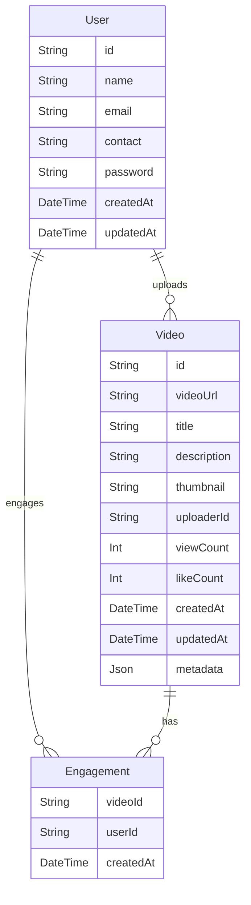
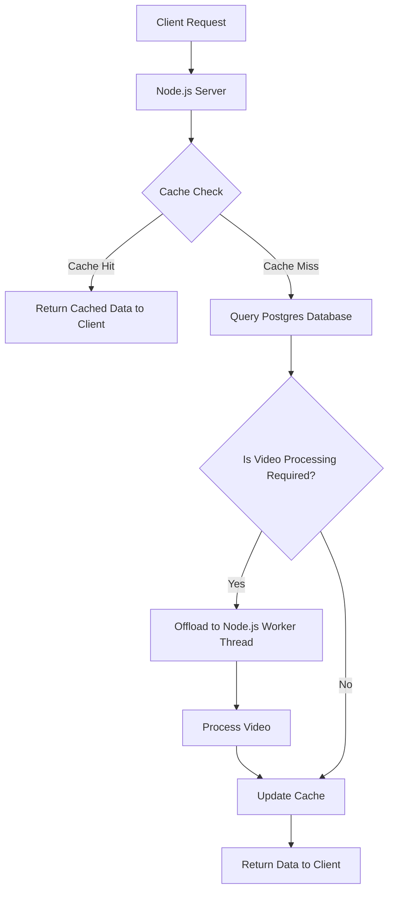

# **ReelShare Server**

---

## **Table of Contents**

1. [Project Description and Features](#project-description-and-features)
2. [Setup Instructions](#setup-instructions)
3. [API Documentation](#api-documentation)
4. [Database Design](#database-design)
5. [Architecture Diagram](#architecture-diagram)
6. [Technical Decision Explanation](#technical-decision-explanation)
7. [Performance Optimization Strategy](#performance-optimization-strategy)
8. [Deployment Strategy](#deployment-strategy)
9. [System Design Decisions](#system-design-decisions)
10.   [Possible Improvements](#possible-improvements)
11.   [Conclusion](#conclusion)

---

## **Project Description and Features**

ReelShare Server is a high-performance, TypeScript-based backend designed to power a seamless video-sharing platform. It enables users to upload, process, and stream short-form videos efficiently while ensuring security, scalability, and observability.

Built with modern technologies like Node.js, PostgreSQL, Redis, MinIO, and Docker, it provides essential video processing features, including on-the-fly compression, thumbnail extraction, caching, and rate limiting. The backend is optimized for performance with background workers, log rotation, and API monitoring using Prometheus and Grafana.

With a Dockerized architecture and CI/CD deployment on AWS EC2, ReelShare Server ensures reliability and easy scalability. The platform is ideal for video-centric applications, allowing developers to extend and integrate new features effortlessly. 🚀

### **Key Features**

-  **TypeScript-Based Application**: Built with TypeScript for type safety, scalability, and maintainability.
-  **User Authentication**: Basic user authentication using JSON Web Tokens (JWT) for secure access.
-  **Video Uploading**: Seamless video upload functionality.
-  **Video Compression**: On-the-fly video compression to optimize storage and bandwidth usage.
-  **Thumbnail Extraction**: Automatic extraction of thumbnails from uploaded videos for preview purposes.
-  **Log Generation with Rotation**: Comprehensive logging with log rotation to manage disk space efficiently.
-  **Caching with Redis**: High-performance caching using Redis to reduce database load and improve response times.
-  **Rate Limiting**: Built-in rate limiting to prevent abuse and protect against DDoS attacks.
-  **API Monitoring**: Integrated monitoring using Prometheus and Grafana for real-time performance insights.
-  **Nginx Reverse Proxy**: Configured Nginx as a reverse proxy to efficiently route incoming requests to the appropriate application containers, ensuring high availability and scalability.

---

## **Setup Instructions**

To run ReelServer, you need to have Docker installed on your system. Follow the steps below to set up and run the application.

### **Prerequisites**

-  Docker installed on your system.
-  Docker Compose installed.

### **Steps to Run the Application**

1. **Clone the Repository**:

   ```bash
   git clone https://github.com/mizanmahi/reelserver.git
   cd reelserver
   ```

2. **Set Up Environment Variables**:
   Create a `.env` file in the root directory and add the necessary environment variables. Refer to the `docker-compose.yml` file for required variables.

3. **Run Docker Compose**:
   Start all the services using Docker Compose:

   ```bash
   docker-compose up -d
   ```

4. **Verify Running Containers**:
   Check the status of the running containers:
   ```bash
   docker-compose ps
   ```

### **Ports and Services**

-  **PostgreSQL**: `5431` (Host) → `5432` (Container)
-  **MinIO**: `9000` (API) and `9001` (Console)
-  **Redis**: `6379` (Redis) and `8001` (Redis Stack for Insight)
-  **Prometheus**: `9090`
-  **Application**: `5000`

---

## **API Documentation**

Explore the API endpoints and test them using the provided Postman documentation:  
[Postman Documentation Link](https://documenter.getpostman.com/view/28371413/2sAYX3s4Sk)

---

## **Database Design**

The database design consists of three main models: `User`, `Video`, and `Engagement`. Below is an explanation of the relationships between these models, followed by a diagram.

### Relationships

1. **User**:

   -  A `User` can create multiple `Videos` (one-to-many relationship).
   -  A `User` can engage with multiple `Videos` through the `Engagement` model (many-to-many relationship).

2. **Video**:

   -  A `Video` is uploaded by a single `User` (many-to-one relationship).
   -  A `Video` can have multiple `Engagements` (one-to-many relationship).
   -  A `Video` contains metadata (stored as JSON) and engagement metrics like `viewCount` and `likeCount`.

3. **Engagement**:
   -  The `Engagement` model represents interactions between a `User` and a `Video` (e.g., likes, views, etc.).
   -  It is a join table that connects `User` and `Video` in a many-to-many relationship.
   -  Each engagement record is uniquely identified by a composite key (`videoId` and `userId`).

### Diagram

Below is a diagram illustrating the relationships between the `User`, `Video`, and `Engagement` models:



---

## **Architecture Diagram**

Below is a high-level architecture diagram of ReelServer:



---

## **Technical Decision Explanation**

1. **TypeScript**: Chosen for its static typing, which reduces runtime errors and improves code maintainability.
2. **JWT for Authentication**: Provides a stateless and scalable way to handle user authentication.
3. **PostgreSQL**: Selected for its reliability, robustness, and support for complex queries. It is well-suited for handling structured data like user information, video metadata, engagements and logs.
4. **FFmpeg for Video Processing**: Used for video compression and thumbnail extraction due to its versatility, performance, and wide support for various video formats and codecs.
5. **Redis for Caching**: Enhances performance by reducing database load for frequently accessed data.
6. **MinIO for Storage**: Offers an S3-compatible object storage solution, ideal for handling large video files.
7. **Prometheus and Grafana**: Provides robust monitoring and visualization capabilities for API performance and health.
8. **Docker and Docker Compose**: Simplifies deployment and ensures consistency across development, testing, and production environments.

---

## **Performance Optimization Strategy**

1. **Caching**: Use Redis to cache frequently accessed data, reducing database queries.
2. **Rate Limiting**: Implement rate limiting to prevent abuse and ensure fair usage of resources.
3. **Video Compression**: Compress videos during upload to save storage and reduce bandwidth usage.
4. **Log Rotation**: Manage log files efficiently to prevent disk space issues.
5. **Asynchronous Processing**: Offload tasks like video compression and thumbnail extraction to background workers. Used multi-threading with worker_threads. 🔄
6. **Fine-Tuning Compression**: Reduce payload size using gzip or Brotli compression. ⚡

---

## **Deployment Strategy**

ReelServer is deployed on an EC2 instance using GitHub Actions for CI/CD. Below is the deployment workflow:

### **Deployment Workflow**

1. **Trigger**: The workflow is triggered on a push or pull request to the `main` branch.
2. **SSH Configuration**: The workflow configures SSH access to the EC2 instance.
3. **File Transfer**: The application files are transferred to the EC2 instance using `rsync`.
4. **Docker Setup**: Ensures Docker and Docker Compose are installed on the EC2 instance.
5. **Container Management**: Stops existing containers, prunes unused resources, and starts new containers using Docker Compose.
6. **Nginx Reverse Proxy**: Configures Nginx as a reverse proxy to route incoming traffic on port 80 to the application running in the Docker container.

### **Accessing the Deployed Server**

The application is deployed at:

**EC2 Instance URL:** `http://34.201.206.110/`

#### **Video Hosting Disclaimer**

The videos are hosted on MinIO locally on the server. This means that they may not play when accessed via `localhost`. To properly access videos, use the public IP of the EC2 instance instead of `localhost`.

Example:

-  ❌ `http://localhost:9000/videos/videos/compressed_1738561984341_IMG_2468.mp4`
-  ✅ `http://serverPublicIp:9000/videos/videos/compressed_1738561984341_IMG_2468.mp4`

For a better experience, clone and run both the frontend and backend on your machine. Below is the frontend repo link:

**Frontend Repository:** [Frontend Repo Link](https://github.com/mizanmahi/reelclient.git)

### **Deployment YAML**

For the complete `deploy.yml` file, refer to the [deploy.yml file](https://github.com/mizanmahi/reelserver/blob/main/.github/workflows/deploy.yml) in the repository.

### **Possible Improvements**

The current deployment can be improved in several ways:

1. **HTTP Live Streaming (HLS)**: Implementing HLS can allow efficient streaming of video data instead of direct file serving.
2. **NGINX with SSL Certificate**: Deploying the application behind an NGINX reverse proxy with an SSL certificate (Let's Encrypt) would improve security and allow HTTPS access.
3. **Auto-Scaling with Load Balancer**: Using AWS Auto Scaling with an Elastic Load Balancer (ELB) can handle traffic spikes effectively.
4. **S3 & CloudFront for Video Hosting**: Instead of hosting videos on MinIO locally, using AWS S3 with CloudFront CDN would improve video delivery speed and availability.

These improvements can enhance performance, scalability, and security of the deployment. Let me know if you want to implement any of them! 🚀

## **System Design Decisions**

For the complete System Design Decisions refer to the [SystemDesignDecisions.md file](https://github.com/mizanmahi/reelserver/blob/main/SystemDesignDecisions.md).

---

## **Conclusion**

ReelServer is a powerful and scalable solution for managing video workflows. With its robust features, efficient architecture, and seamless deployment process, it is designed to meet the needs of modern video processing applications.
